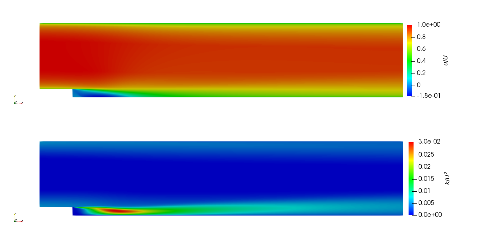
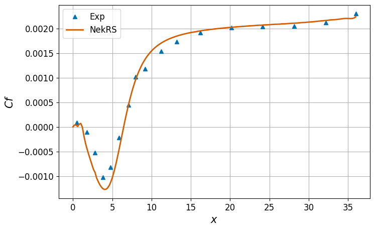

Backward Facing Step
====================

.. _bfs:

The experimental data of Driver \& Seegmiller [Driver1985]_ in a 2D backward-facing step configuration is one of the essential benchmarks used for validation of RANS models.
Predicted reattachment length downstream of the step location obtained from any turbulence model is widely used as a key parameter for assessing its success.
The step is located at the origin and the inlet and outlet of the domain are located at :math:`x/H=-4` and :math:`40`, respectively; where :math:`H` is the step height.
The channel height upstream and downstream of the step are :math:`8H` and :math:`9H`, respectively.
The Reynolds number based on the incoming free stream velocity, :math:`U`, and step height is :math:`Re=37,425`.
Simulation is performed using the :math:`k-\tau` RANS model in NekRS and advanced to quasi-steady state to qualify this CI test.
:numref:`fig:bfs1` shows the steady state contours of velocity and turbulent kinetic energy obtained for the bfs case.

.. _fig:bfs1:

  Steady state contours of streamwise velocity and turbulent kinetic energy.

The CI test evaluates the :math:`L_2` norm of the absolute error in skin friction coefficient at the downstream wall from the step, :math:`x>0`, measured against the experimentally reported values by Driver \& Seegmiller [Driver1985]_.

.. math::

  \| C_f - C_f^{exp}\|_{L2};\,\, C_f = \frac{2 \tau_w}{\rho_0 U^2}

where :math:`\tau_w` is the wall shear stress, :math:`\rho_0` is the reference density and :math:`U` is the reference velocity.
:numref:`fig:bfs2` shows the evaluated skin friction coefficient profile, evaluated at the downstream wall from the step by the CI test, compared against experimental data.
Polynomial fit is obtained through the experimental data to evaluate the error norm in the above equation to qualify the CI test.

.. _fig:bfs2:

  Comparison of skin friction coefficient profile with experimental data from Driver \& Seegmiller [Driver1985]_.
