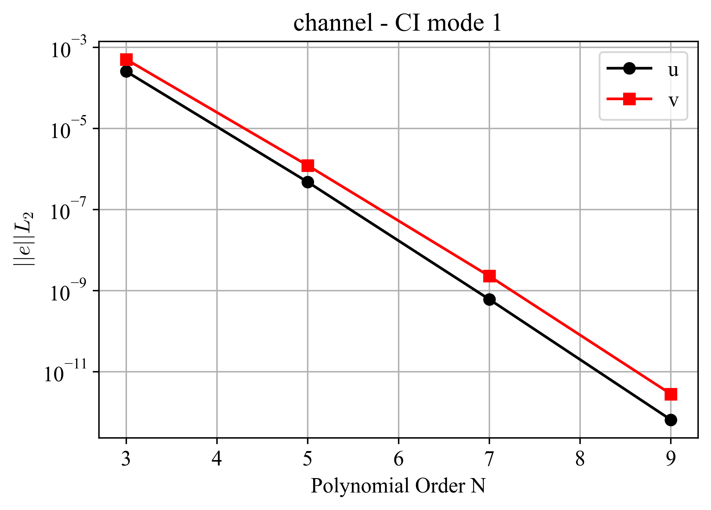
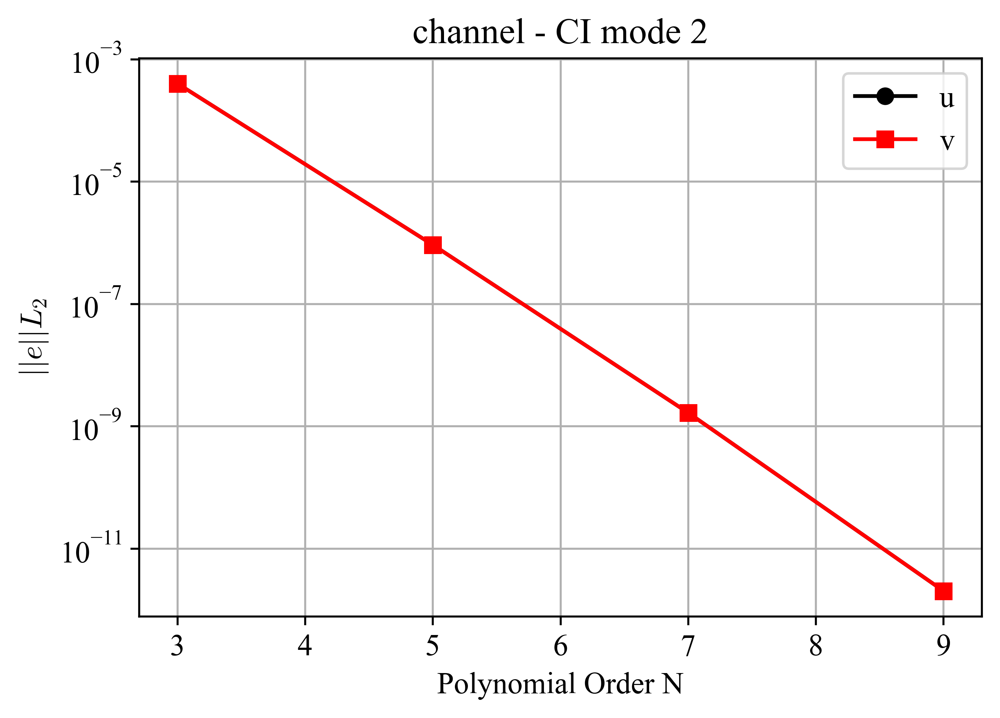

Stokes Flow
===========

.. _channel:

NekRS provides the option to solve unsteady Stokes flow with constant or variable viscosity.
The *channel* case verifies the Stokes flow solver using the method of manufactured solutions (MMS).
The problem is solved in a quasi-two-dimensional square domain with edge length 2 and an arbitrary user-specified orientation angle :math:`\alpha`.
The manufactured steady-state solution is

.. math::

  u' &= U_0 \cos(\pi (x+0.5)) \sin(\pi (2y + 0.5)) \\
  v' &= -\frac{U_0}{2} \sin(\pi (x+0.5)) \cos(\pi (2y + 0.5)) \\
  u(x,y) &= u' \cos(\alpha) - v' \sin(\alpha) \\
  v(x,y) &= u' \sin(\alpha) + v' \cos(\alpha)

The manufactured viscosity field is

.. math::

  \nu(x,y) = \frac{1}{Re} (1 + ay)

where :math:`Re` is the Reynolds number, :math:`U_0` is a user-specified velocity scale, :math:`a` is a user-specified viscosity scaling parameter, and :math:`u` and :math:`v` are the velocity components in the :math:`x` and :math:`y` directions, respectively.
The corresponding forcing function is

.. math::

  \vec{f} = - \nabla \nu \left(\nabla \vec{v} + \nabla \vec{v}^T \right)

The CI tests are performed using a polynomial order of seven and two CI modes.
CI mode 1 uses the original geometry, while CI mode 2 rotates the geometry by :math:`45^\circ`.
Errors are evaluated at :math:`t=0.1`.
:numref:`fig:channel1` and :numref:`fig:channel2` present the volume-integrated error norms for the two CI modes.
The results demonstrate spectral convergence of the velocity solution, thereby verifying the accuracy of the Stokes flow solver.

.. _fig:channel1:

  Volume-integrated error norms for the *channel* case, CI mode 1.

.. _fig:channel2:

  Volume-integrated error norms for the *channel* case, CI mode 2.
