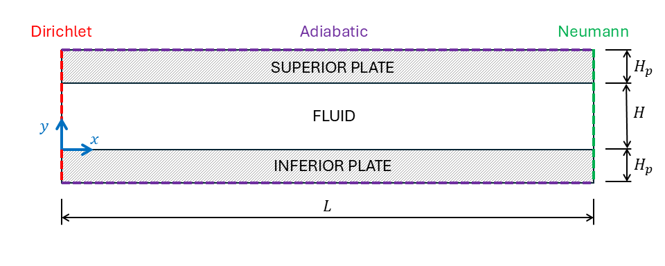

Conjugate Heat Transfer
=======================

.. _conj_ht:

NekRS offers an in-built module to perform conjugate heat transfer (CHT) simulations with conforming fluid and solid domains.
The *conj_ht* transfer case is designed to test the CHT module against an analytical solution.
The schematic of the case setup is described in :numref:`fig:conj_ht_geometry`.
The domain comprises a fluid channel of height :math:`H` enclosed by solid plates of equal height :math:`H_p`.
The length of fluid channel and solid plates is :math:`L`, while the domain is periodic in transverse :math:`z` direction.

.. _fig:conj_ht_geometry:

  conj_ht geometry and boundary conditions.

Fully developed flow and thermal conditions are considered in the domain.
The flow in the channel maintains Poiseuille flow profile, given by,

.. math::

   u(y) = Re \frac{dp}{dx} y(1-y)

A non-dimensional uniform heat source, :math:`\dot{q}`, is considered in both solid plates.
The analytical solution for temperature is given as,

.. math::

   T_F (x,y) =  -\dot{q} Pe \frac{H_p}{H} \left[y^4 - 2y^3 + y\right] + \dot{q} \frac{H_p}{H} \left[2x + \frac{17}{10} Pe \right] \\
   T_I(x,y) = -\dot{q} Pe \frac{1}{k_r} \left[\frac{y^2}{2} + y \frac{H_p}{H} \right] + \dot{q} \frac{H_p}{H} \left[2x + \frac{17}{10} Pe \right] \\
   T_S(x,y) = -\dot{q} Pe \frac{1}{k_r} \left[\frac{y^2}{2} - y \left(1 + \frac{H_p}{H}\right) + \left(\frac{1}{2} + \frac{H_p}{H} \right) \right] + \dot{q} \frac{H_p}{H} \left[2x + \frac{17}{10} Pe \right]

where :math:`T_F` is the temperature in the fluid channel and :math:`T_I, T_S` are temperature solutions in the inferior and superior solid plates.
:math:`k_r` is the ratio of the thermal conductivity of solid, :math:`k_s` to fluid, :math:`k_f`.
:math:`Re` and :math:`Pe` are the Reynolds and Peclet number, respectively,

.. math::

  Re = \frac{\rho_f U_0 H}{\mu_f} \\
  Pe = \frac{\rho_f U_0 H c_{pf}}{k_f}

The specific non-dimensional parameters for the *conj_ht* CI case are enumerated in :numref:`tab:setup`. 

.. _tab:setup:

.. csv-table:: Case properties and simulation parameters.
   :align: center
   :header: "Parameter name","Variable","Value"
   :widths: 15, 10, 5

   "Non-dimensional channel height",":math:`H`","1"
   "Non-dimensional channel length",":math:`L`","8"
   "Non-dimensional plate height",":math:`H_p`", "0.5"
   "Reynolds Number",":math:`Re`","500"
   "Peclet Number",":math:`Pe`","1000"
   "Heat source",":math:`\dot{q}`","1"
   "Fluid density",":math:`\rho_f`","1"
   "Fluid volumetric heat capacity",":math:`\rho_f c_{pf}`","1"
   "Solid volumetric heat capacity",":math:`\rho_s c_{ps}`","0.1"
   "Solid to fluid conductivity ratio",":math:`k_r`","10"
   "Pressure gradient", ":math:`\frac{\partial p}{\partial x}`", "0.012"

Dirichlet boundary conditions are imposed at :math:`x=0` for both fluid and temperature equations.
Outflow boundary condition is imposed at :math:`x=L` for fluid and Neumann condition for temperature equation, obtained from the analytical solution,

.. math::

  \left. \frac{k}{Pe} \nabla T \cdot \vec{n} \right|_{x=L} =  \left. \frac{k}{Pe} \frac{\partial T}{\partial x} \right|_{x=L} = 2 \dot{q} \frac{H_p}{H} \frac{k}{Pe}

where :math:`\vec{n}` is the outward pointing normal vector at the outflow boundary and :math:`k=1` for fluid and :math:`k=k_r` for solid.
At the top and bottom faces of the solid plates insulated boundary conditions are imposed.
The CI tests are qualified by measuring the :math:`L_2`-norm of absolute error in streamwise velocity and temperature at steady-state.
