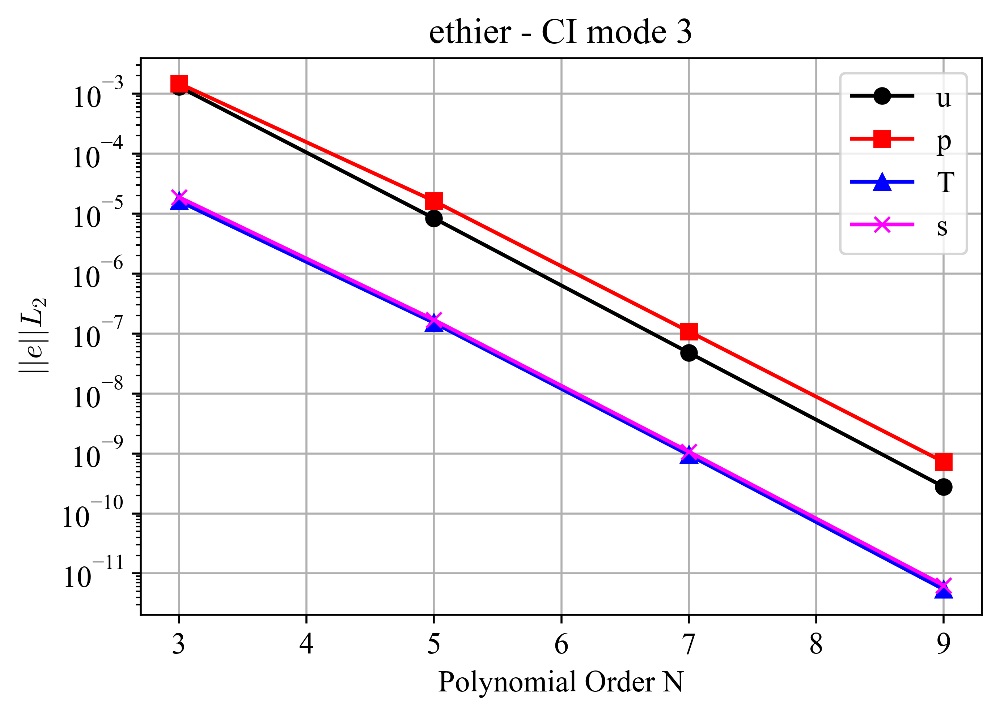
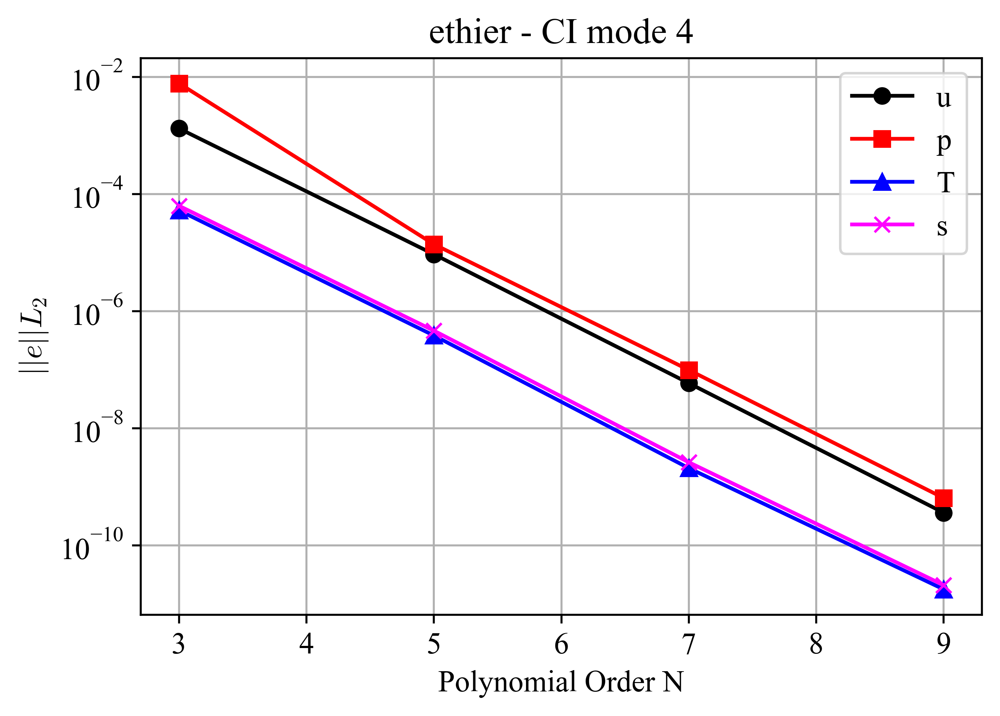
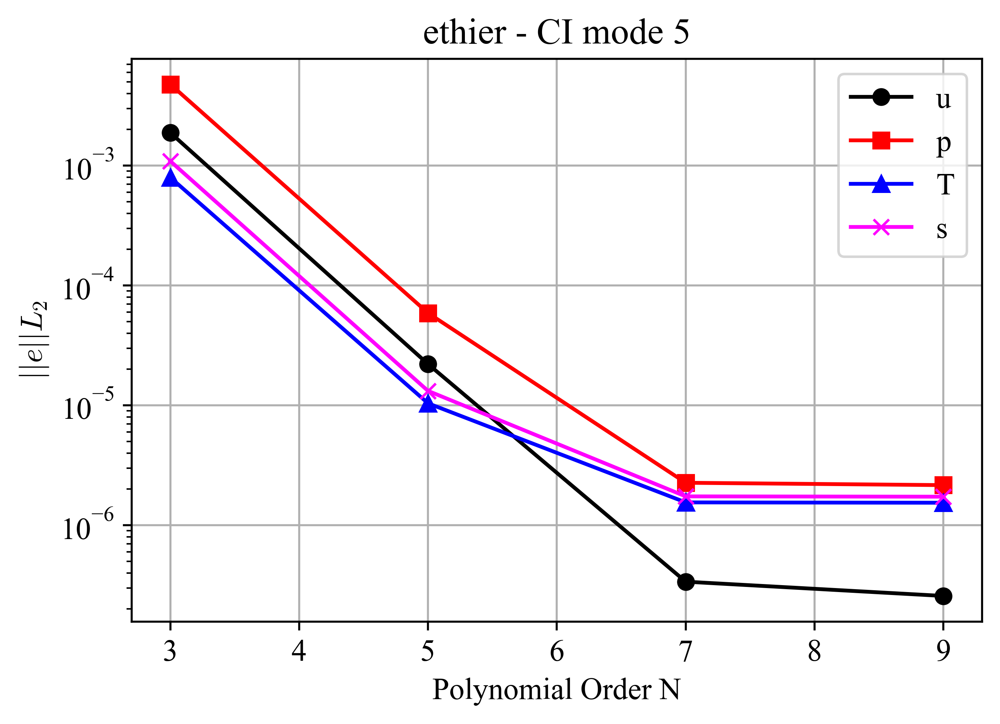
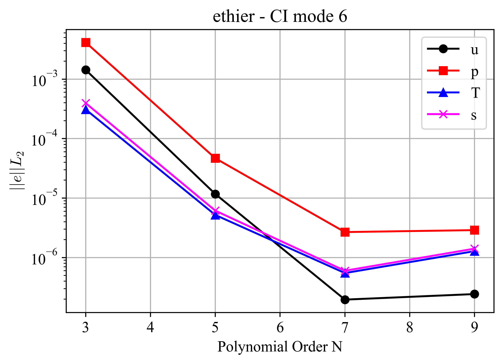
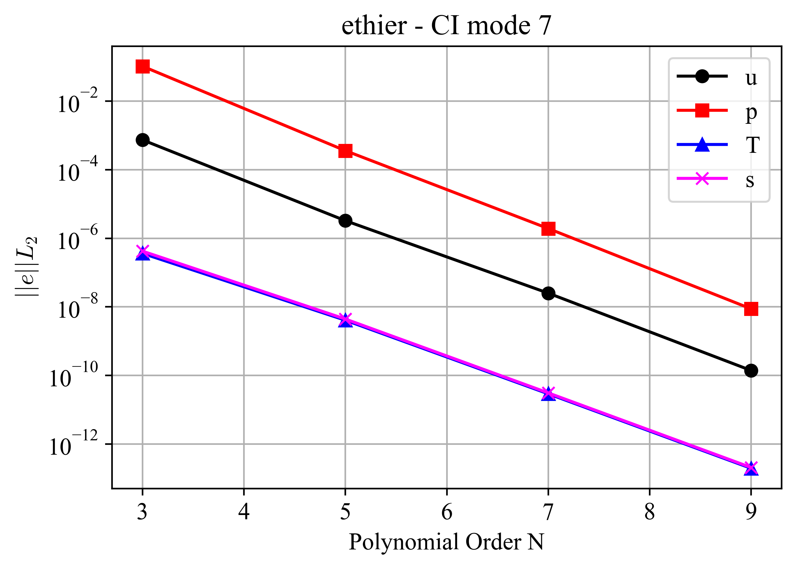
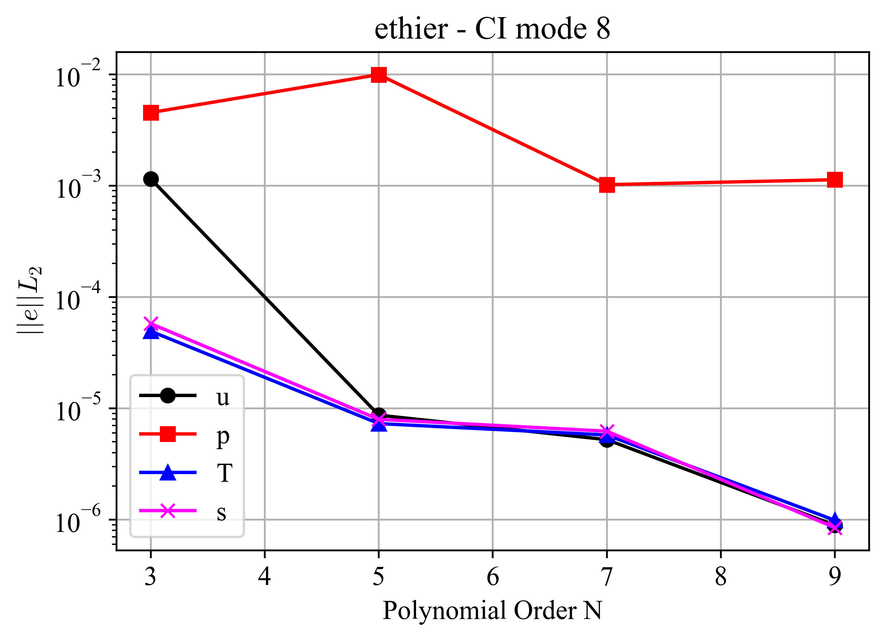
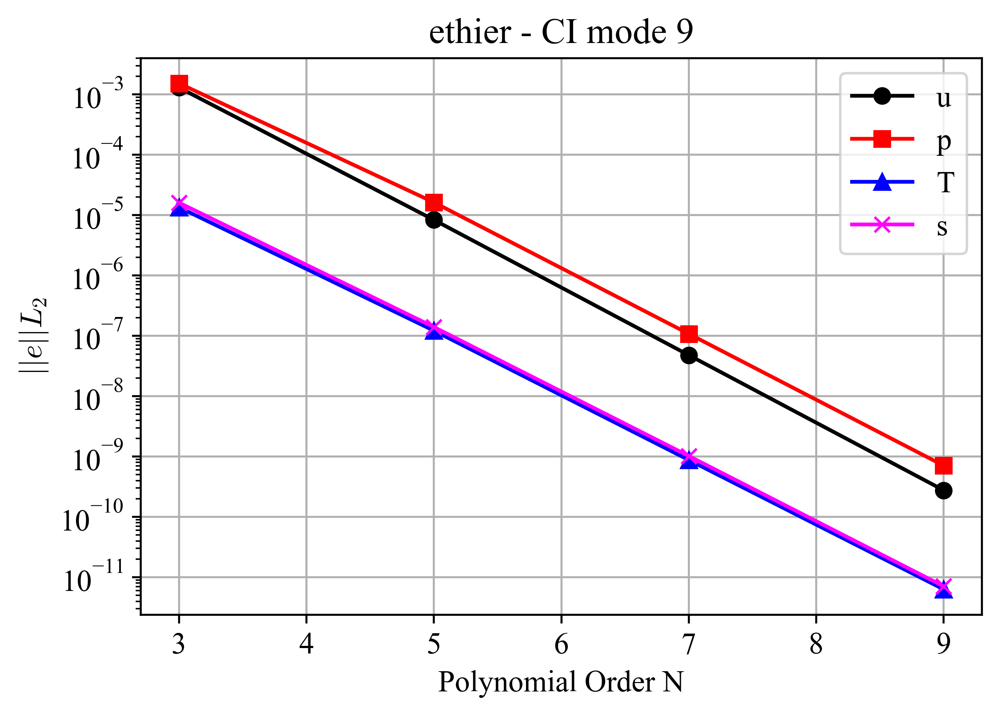
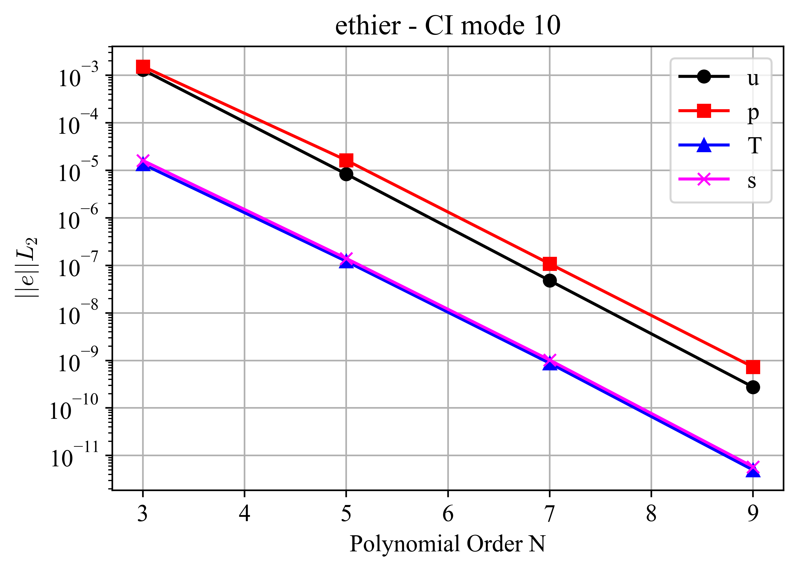
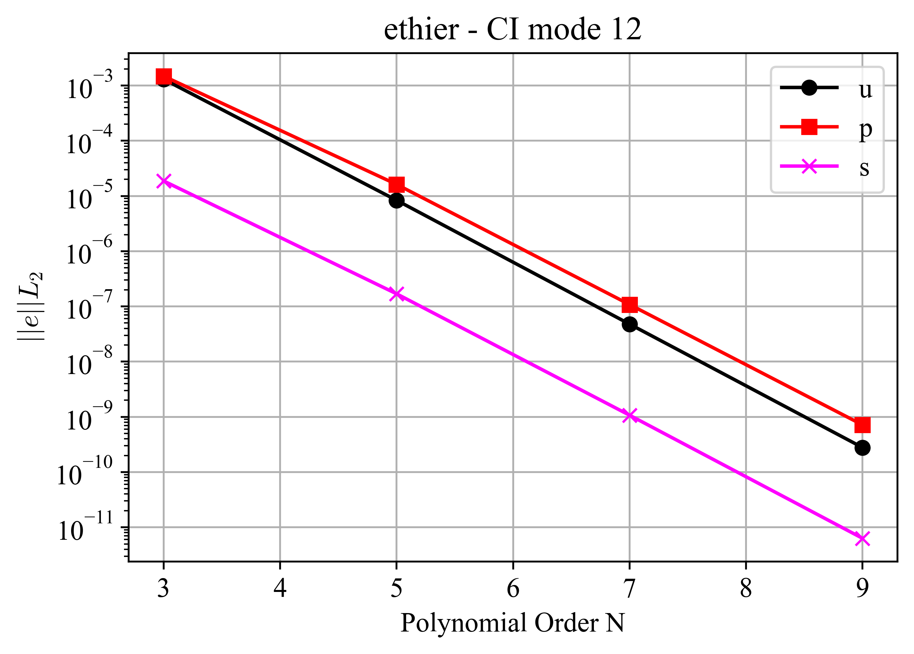
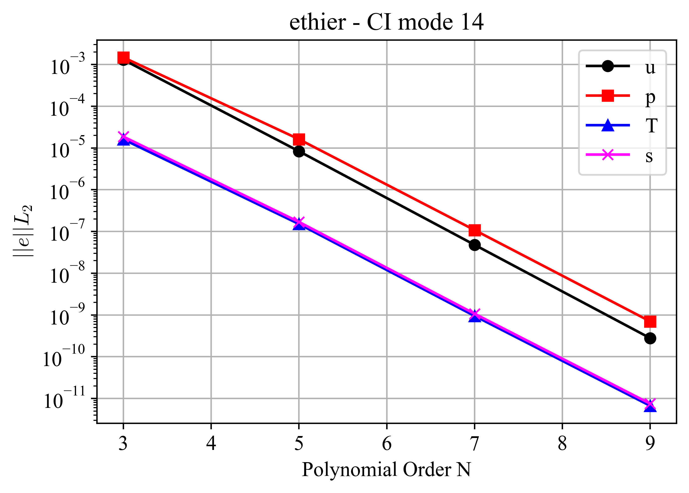

Ethier
=======

.. _ethier:

This case is adopted from the non-trivial, exact solution of the three-dimensional incompressible Navier--Stokes equations developed by Ethier and Steinman [Ethier1994]_ for benchmarking incompressible CFD solvers.
The Ethier solution is also used to verify the passive scalar solvers in NekRS.
This is accomplished by selecting the x-component of the velocity field as the transported passive scalar and using the pressure term from the momentum equation as the source term, making the passive scalar transport equation identical to the x-momentum equation.
Because the analytical solution is known throughout the domain and for all times, both the incompressible flow and passive scalar solvers can be verified using only a few time steps, minimizing the computational cost of each regression test.
Consequently, the *ethier* case is used to verify several capabilities of NekRS through multiple CI modes.

The problem is set up in a :math:`[-1,1]` cube domain with Dirichlet boundary conditions assigned for the velocity solver and Dirichlet and Neumann boundary conditions assigned for the passive scalars :math:`s_1` and :math:`s_2`, respectively.
The boundary conditions are obtained from the Ethier analytical solution [Ethier1994]_, given as,

.. math::

  u & =  -a \left[ e^{ax} sin(ay + dz) + e^{az} cos(ax + dy)\right] e^{-d^2 t} \\
  v & =  -a \left[ e^{ay} sin(az + dx) + e^{ax} cos(ay + dz)\right] e^{-d^2 t} \\
  w & =  -a \left[ e^{az} sin(ax + dy) + e^{ay} cos(az + dx)\right] e^{-d^2 t} \\
  p & =  -\frac{a^2}{t} \left[e^{2ax}+e^{2ay}+e^{2az} \right. \\
    & +         2 sin(ax+dy)cos(az+dx)e^{a(y+z)} \\
    & +         2 sin(ay+dz)cos(ax+dy)e^{a(z+x)} \\
    & +  \left. 2 sin(az+dx)cos(ay+dz)e^{a(x+y)} \right]e^{-2d^2t}

where :math:`a,d` are user-specified parameters, :math:`\{x,y,z\}` are the coordinate locations, :math:`\{u,v,w\}` are the velocity components, :math:`p` is the pressure, and :math:`t` is the time.
For the passive scalar verification tests, the transported variable is the x-component of velocity, :math:`u`.

The solution fields are :math:`\phi=\{u,p,s_1,s_2\}`, corresponding to the x-velocity, pressure, passive scalars 1 and 2, respectively.

For all CI modes, volume-integrated error norms were computed for multiple polynomial orders :math:`N` using the velocity, pressure, and passive scalar fields.
The figures presented below demonstrate the spectral convergence of the solution as the polynomial order increases, confirming the accuracy and consistency of both the flow and passive scalar solvers.
To assess solver performance, the number of iterations required for the convergence of the velocity, pressure, and passive scalar solvers is also included in the tests.
The specific NekRS capabilities verified by each CI mode are described below.

CI Mode 2
---------

This CI mode verifies the correct functioning of the following capabilities of NekRS:

  * Incompressible Navier-Stokes and passive scalar solvers.
  * Block velocity solver.
  * Characteristic subcycling.

Errors were computed at :math:`t=0.06` and are shown in :numref:`fig:ethier_2`.

.. _fig:ethier_2:

  :math:`L_2`-norm of errors for case ethier - CI mode 2.

CI Mode 3
---------

This CI mode verifies the correct functioning of:

  * Velocity and pressure projection.
  * SEMFEM pressure preconditioner.

Errors were computed at :math:`t=0.06` and are shown in :numref:`fig:ethier_3`.

.. _fig:ethier_3:

  :math:`L_2`-norm of errors for case ethier - CI mode 3.

CI Mode 4
---------

This CI mode verifies the combined operation of the following capabilities:

  * Incompressible Navier-Stokes and passive scalar solvers.
  * Block velocity solver.
  * Characteristic subcycling.
  * Velocity and pressure projection.

Errors were computed at :math:`t=0.2` and are shown in :numref:`fig:ethier_4`.

.. _fig:ethier_4:

  :math:`L_2`-norm of errors for case ethier - CI mode 4.

CI Mode 5
---------

This CI mode tests:

  * Moving mesh formulation.
  * Block velocity solver.

Errors were computed at :math:`t=0.2` and are shown in :numref:`fig:ethier_5`.

.. _fig:ethier_5:

  :math:`L_2`-norm of errors for case ethier - CI mode 5.

CI Mode 6
---------

This CI mode tests:

  * Moving mesh formulation.
  * Block velocity solver.
  * Characteristic subcycling.

Errors were computed at :math:`t=0.2` and are shown in :numref:`fig:ethier_6`.

.. _fig:ethier_6:

  :math:`L_2`-norm of errors for case ethier - CI mode 6.

CI Mode 7
---------

This CI mode tests:

  * Velocity and pressure projection.
  * Jacobi pressure preconditioner.

Errors were computed at :math:`t=0.012` and are shown in :numref:`fig:ethier_7`.

.. _fig:ethier_7:

  :math:`L_2`-norm of errors for case ethier - CI mode 7.

CI Mode 8
---------

This CI mode tests:

  * Pressure projection.
  * Adaptive time stepping.

This CI mode also verifies that the final CFL number remains below the specified target value and that the expected number of time steps is taken.
Errors were computed at :math:`t=0.2` and are shown in :numref:`fig:ethier_8`.

.. _fig:ethier_8:

  :math:`L_2`-norm of errors for case ethier - CI mode 8.

CI Mode 9
---------

This CI mode tests:

  * Convective advection formulation without dealiasing.
  * Block velocity solver.
  * Characteristic subcycling.
  * Velocity and pressure projection.

Errors were computed at :math:`t=0.06` and are shown in :numref:`fig:ethier_9`.

.. _fig:ethier_9:

  :math:`L_2`-norm of errors for case ethier - CI mode 9.

CI Mode 10
----------

This CI mode tests:

  * Convective advection formulation without dealiasing.
  * Block velocity solver.
  * Velocity and pressure projection.

Errors were computed at :math:`t=0.06` and are shown in :numref:`fig:ethier_10`.

.. _fig:ethier_10:

  :math:`L_2`-norm of errors for case ethier - CI mode 10.

CI Mode 11
----------

This CI mode tests:

  * Chebyshev-accelerated damped-Jacobi pressure multigrid smoother.
  * Block velocity solver.
  * Characteristic subcycling.
  * Pressure projection.

Errors were computed at :math:`t=0.06` and are shown in :numref:`fig:ethier_11`.

.. _fig:ethier_11:

  :math:`L_2`-norm of errors for case ethier - CI mode 11.

CI Mode 12
----------

This CI mode tests:

  * Passive scalar 0 disabled.

Errors were computed at :math:`t=0.06` and are shown in :numref:`fig:ethier_12`.
Additionally, the test verifies that passive scalar 0 is disabled while passive scalar 1 continues to be solved correctly.

.. _fig:ethier_12:

  :math:`L_2`-norm of errors for case ethier - CI mode 12.

CI Mode 14
----------

This CI mode tests:

  * Additive overlapping Schwarz pressure multigrid smoother.
  * Block velocity solver.
  * Characteristic subcycling.
  * Pressure projection.

Errors were computed at :math:`t=0.06` and are shown in :numref:`fig:ethier_14`.

.. _fig:ethier_14:

  :math:`L_2`-norm of errors for case ethier - CI mode 14.
