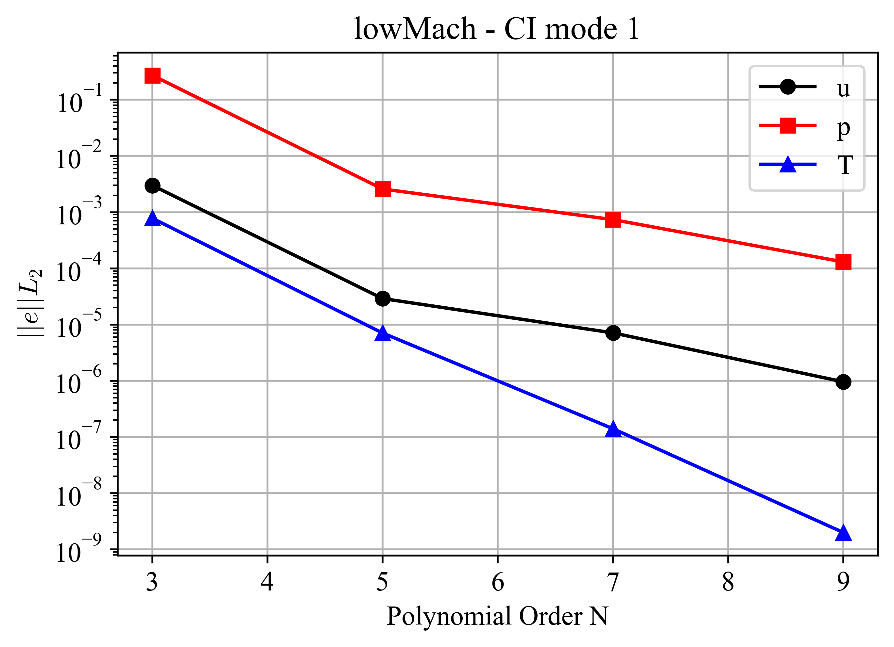
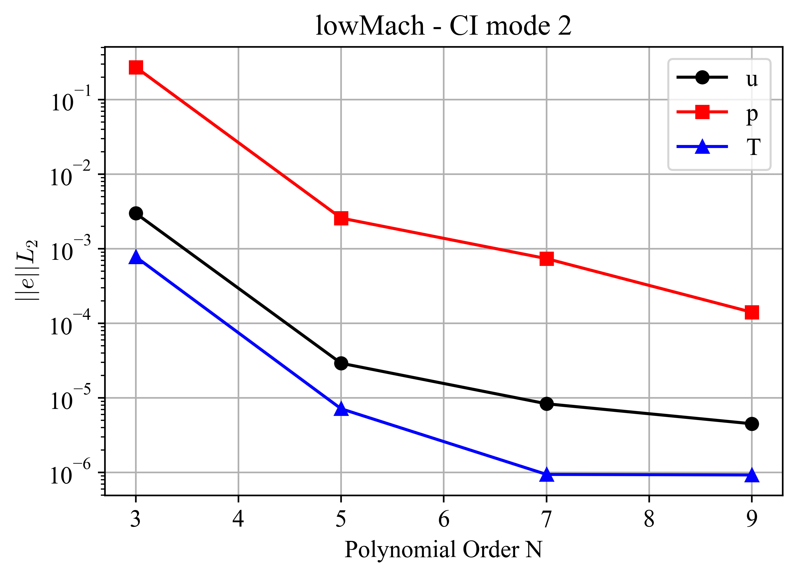

Low-Mach Test
=============

.. _lowMach:

The low-Mach governing equations are obtained by filtering acoustic waves from the fully compressible Navier--Stokes equations.
The pressure is decomposed into a spatially uniform, leading-order thermodynamic component and a first-order hydrodynamic component that appears in the momentum equation [Tombo1997]_.
The low-Mach formulation is applicable to low-speed flows with significant density variations, such as reactive flows and natural convection, where thermal expansion must be captured while acoustic waves are neglected.

The *lowMach* case is adopted from Tomboulides *et al.* [Tombo1998]_.
The problem is a non-trivial, quasi-two-dimensional verification problem derived from the following one-dimensional system,

.. math::

  u \frac{\partial T}{\partial x} &= \frac{\alpha}{Re Pr} \frac{\partial^2 T}{\partial x^2} + \dot{q}_0 \\
  u \frac{\partial u}{\partial x} &= \frac{4\nu}{3 Re} \frac{\partial^2 u}{\partial x^2} - \frac{1}{\rho} \frac{\partial p_1}{\partial x} \\
  u \frac{\partial \rho}{\partial x} &= -\rho \frac{\partial u}{\partial x} \\
  \rho T &= 1

where :math:`T` is the temperature, :math:`u` is the x-component of velocity, :math:`\alpha` is the thermal diffusivity, :math:`Re` is the Reynolds number, :math:`Pr` is the Prandtl number, :math:`\dot{q}_0` is the volumetric heat source, :math:`\nu` is the kinematic viscosity, :math:`p_1` is the hydrodynamic pressure, :math:`\rho` is the density, and :math:`x` is the spatial coordinate.
The problem is solved on the domain :math:`x \in [-1,1]` and :math:`y,z \in [0,1]`, with periodic boundary conditions applied in the :math:`y` and :math:`z` directions.
The volumetric heat source introduced by Tomboulides *et al.* [Tombo1998]_ is

.. math::

  \dot{q}_0 = \frac{1}{\delta} sech^2 \left(\frac{x}{\delta}\right) \left( \frac{1}{2} + \frac{1}{\delta Re Pr} tanh \left(\frac{x}{\delta}\right) \right)

The exact solution of the system is the smooth step profile

.. math::

  u(x) = T(x) = \frac{1}{2} \left(3 + tanh \left( \frac{x}{\delta} \right) \right)

where :math:`\delta` is a user-specified parameter that controls the sharpness of the solution profile.
Dirichlet boundary conditions are imposed at :math:`x=-1` and :math:`x=1` using the analytical solution.

The CI tests are performed using a polynomial order of seven and two CI modes.
Both CI modes verify the low-Mach solver in NekRS.
CI mode 2 additionally enables characteristic subcycling for the fluid and temperature solvers.
Errors are evaluated at :math:`t=0.3`.
:numref:`fig:lowMach1` and :numref:`fig:lowMach2` present the volume-integrated error norms for the two CI modes.
The results demonstrate spectral convergence for the x-velocity, hydrodynamic pressure, and temperature fields, thereby verifying the accuracy of the low-Mach solver.

.. _fig:lowMach1:

  Volume-integrated error norms for the *lowMach* case, CI mode 1.

.. _fig:lowMach2:

  Volume-integrated error norms for the *lowMach* case, CI mode 2.
