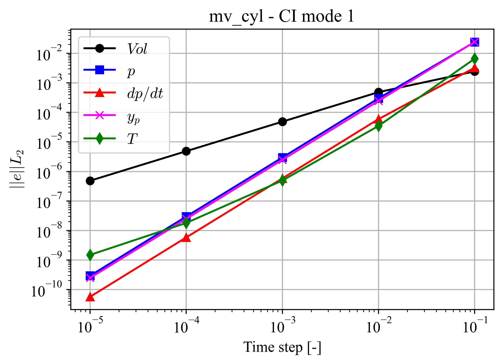
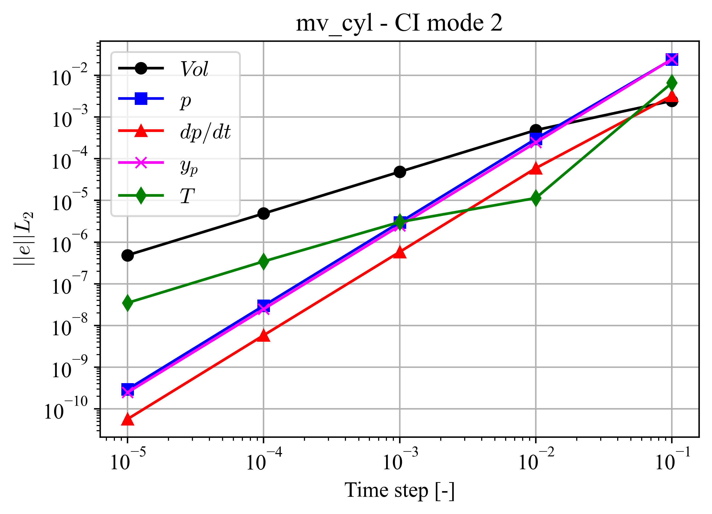
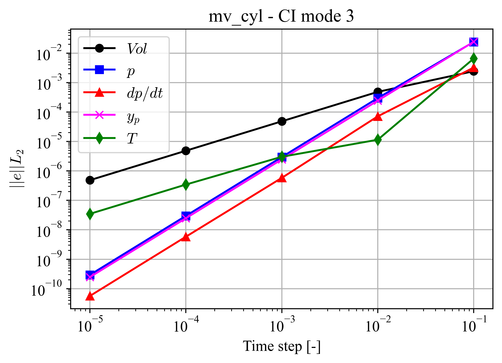
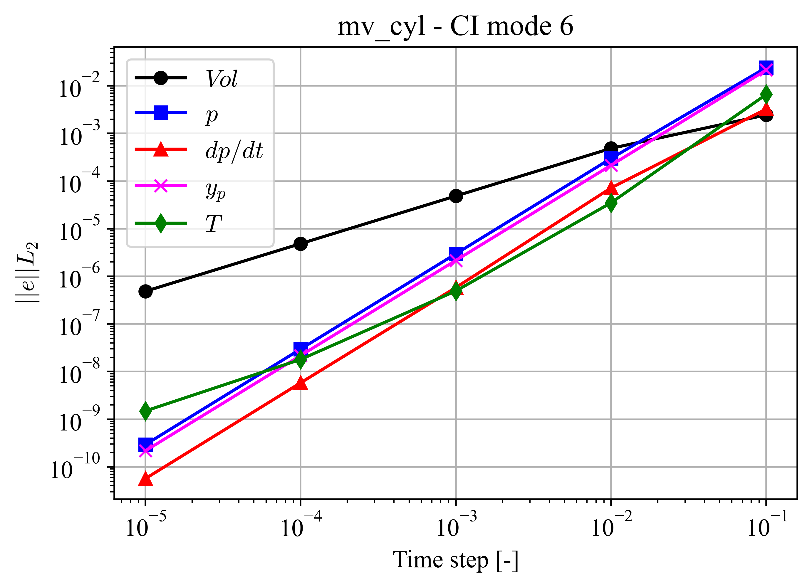

Moving Cylinder (Low-Mach)
==========================

.. mv_cyl:

The *mv\_cyl* case comprises a moving piston in a quasi 2D domain.
The piston is located at :math:`y=-L_y` and a fixed wall is located at :math:`y=0`.
The width of the domain is :math:`L_x` and symmetry conditions are imposed at :math:`x=\{0,L_x\}` boundaries.
This case is designed to test both the low Mach plugin and moving mesh modules in NekRS.
Under the ideal gas assumption, the low Mach governing equations in non-dimensional form are,

.. math::

  \nabla \cdot \vec{v} = \frac{1}{T} \frac{DT}{Dt} - \frac{1}{p_t} \frac{dp_t}{dt} = Q \\
  \rho \left(\frac{\partial \vec{v}}{\partial t} + \vec{v} \cdot \nabla \vec{v} \right) = - \nabla p_1 +  \frac{1}{Re} \nabla \cdot \left(2\boldsymbol{\underline{S}} - \frac{2}{3} Q \boldsymbol{\underline{I}} \right) \\
  \rho c_p \frac{DT}{Dt} = \frac{1}{Pe} \nabla \cdot \nabla T + \frac{\gamma - 1}{\gamma} \frac{dp_t}{dt} \\
  p_t = \rho T

where :math:`Q` is the thermal divergence, :math:`p_t` is the thermodynamic pressure and :math:`p_1` is the hydrodynamic pressure, :math:`\gamma` is the isentropic expansion factor, :math:`\boldsymbol{\underline{S}} = 1/2 (\nabla \vec{v} + \nabla \vec{v}^T)` and :math:`\boldsymbol{\underline{I}}` is the identity tensor.
:math:`Re` and :math:`Pe` are the Reynolds and Peclet number, respectively.
The piston is prescribed a sinusoidal velocity profile, given as,

.. math::

  v_p(t) = A  sin(\omega t)

where :math:`A` is the amplitude of oscillation of the piston surface.
The flow in the domain is isentropic and the analytical solution is given by,

.. math::

  V(t) = V_0 + A_p A \frac{(cos(\omega t) - 1)}{\omega} \\
  p_t(t) = p_0 \left(\frac{V_0}{V(t)}\right)^\gamma \\
  \frac{d p_t}{d t} = \gamma p_0 A_p \frac{V_0}{V(t)^{\gamma+1}} v_p(t) \\
  y_p(t) = -\frac{1}{2}\left(1+cos(\omega t)\right) \\
  Q = \left(\frac{\gamma-1}{\gamma}-1 \right) \frac{1}{p_t(t)} \frac{dp_t}{dt} \\
  \overline{T}(t) = p_t(t)^\frac{\gamma-1}{\gamma}

:math:`y_p(t)` is the location of the piston at time :math:`t`, :math:`V_0` is the initial volume of the domain and :math:`V(t)` is the volume at time :math:`t`.
:math:`p_0` is the initial thermodynamic pressure, :math:`A_p` is the surface area of the piston and :math:`\overline{T}(t)` is the mean temperature in the domain at time :math:`t`.
The CI tests for this case are evaluated and qualified by computing the absolute error in :math:`\{V(t), dV(t)/dt,p_t(t),dp_t/dt,y_p(t),\overline{T}(t)\}` at a specified time :math:`t`.
Further, since all quantities being evaluated are spatially invariant, temporal convergence errors are also analyzed for this case, reported below.
Note that for CI cases :math:`\{1,2,5\}`, the mesh is prescribed a linearly varying velocity field given by,

.. math::

  v_m(y,t) = v_p(t) \frac{y - y_{max}(t)}{y_{min}(t) - y_{max}(t)}

while for the CI cases :math:`\{3,6\}` a mesh solver is employed with a Dirichlet velocity assigned to the piston surface as prescribed above.
Temporal decay of absolute errors for CI cases is shown below.
The plots confirm algebraic temporal convergence.

CI Mode 1
---------

This CI mode verifies the correct functioning of the passive scalar solver NekRS with the moving mesh.
Errors were computed at :math:`t=0.1`, and are shown in :numref:`fig:mv_cyl_1`.

.. _fig:mv_cyl_1:

  :math:`L_2`-norm of errors for case mv_cyl - CI mode 1.

CI Mode 2
---------

This CI mode verifies the correct functioning of the following capabilities of NekRS:

  * All capabilities presented in the CI mode 1.
  * Subcycling.

Errors were computed at :math:`t=0.1`, and are shown in :numref:`fig:mv_cyl_2`.

.. _fig:mv_cyl_2:

  :math:`L_2`-norm of errors for case mv_cyl - CI mode 2.

CI Mode 3
---------

This CI mode verifies the correct functioning of the following capabilities of NekRS:

  * All capabilities presented in the CI mode 2.
  * Elasticity solver.
  * Mesh projection.

Errors were computed at :math:`t=0.1`, and are shown in :numref:`fig:mv_cyl_3`.

.. _fig:mv_cyl_3:

  :math:`L_2`-norm of errors for case mv_cyl - CI mode 3.

CI Mode 5
---------

This CI mode verifies the capabilities presented in the CI mode 1 for an unaligned geometry.
Errors were computed at :math:`t=0.1`, and are shown in :numref:`fig:mv_cyl_5`.

.. _fig:mv_cyl_5:

  :math:`L_2`-norm of errors for case mv_cyl - CI mode 5.

CI Mode 6
---------

This CI mode verifies presented in the CI mode 3 for an unaligned geometry.
Errors were computed at :math:`t=0.1`, and are shown in :numref:`fig:mv_cyl_6`.

.. _fig:mv_cyl_6:

  :math:`L_2`-norm of errors for case mv_cyl - CI mode 6.
