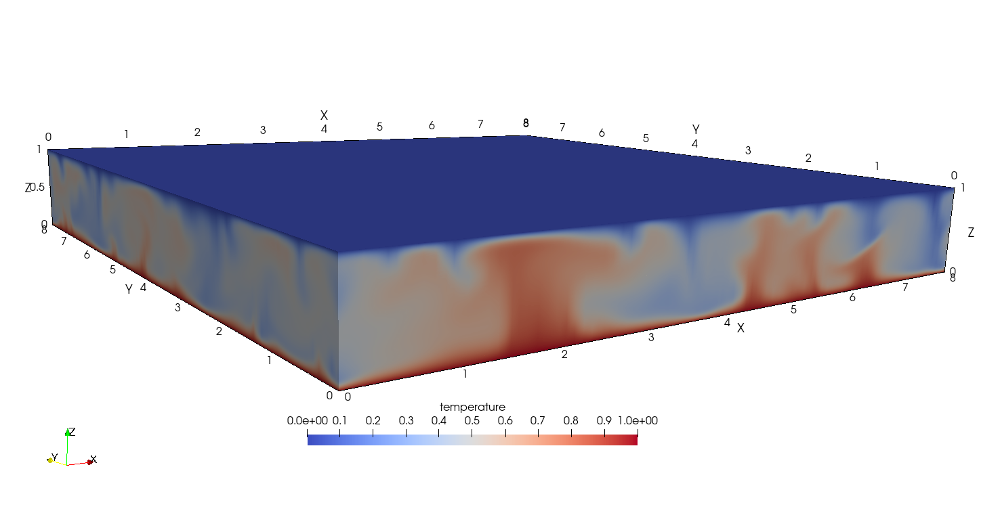
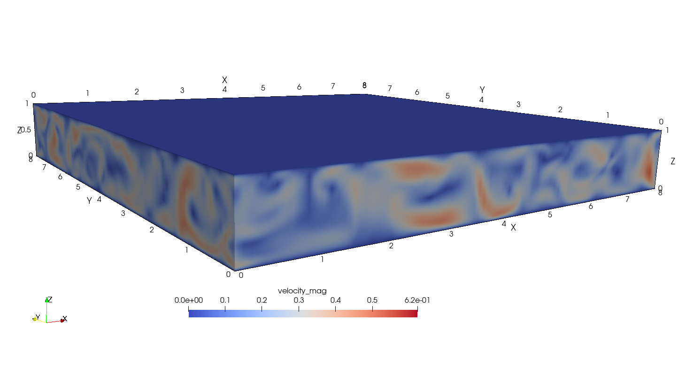

Rayleigh--Bénard Convection
===========================

.. _rbc:

The *rbc* case models turbulent Rayleigh--Bénard convection in a three-dimensional domain using the Boussinesq approximation.
The fluid is heated from below and cooled from above, while the lateral directions are periodic.
The resulting buoyancy forces generate rising hot plumes, descending cold plumes, and large-scale convective circulation.

The computational domain has dimensions :math:`8H\times8H\times H`, where :math:`H` is the domain height, with extents

.. math::

  (x,y,z)\in[0,8H]\times[0,8H]\times[0,H].

The domain is discretized using :math:`16\times16\times8` hexahedral elements in the :math:`x`, :math:`y`, and :math:`z` directions, respectively, for a total of 2,048 elements.
The mesh is uniform in the two periodic lateral directions and stretched in the vertical direction to increase resolution near the thermal and viscous boundary layers.

The nondimensional momentum and temperature equations are

.. math::

  \frac{\partial \boldsymbol{u}}{\partial t}
  + \boldsymbol{u}\cdot\nabla\boldsymbol{u}
  = -\nabla p
  + \sqrt{\frac{Pr}{Ra}}\nabla^2\boldsymbol{u}
  + T\boldsymbol{e}_z,

.. math::

  \frac{\partial T}{\partial t}
  + \boldsymbol{u}\cdot\nabla T
  = \frac{1}{\sqrt{RaPr}}\nabla^2T,

where :math:`Ra=1.7\times10^5` is the Rayleigh number and :math:`Pr=0.7` is the Prandtl number.
Gravity and buoyancy act in the vertical :math:`z` direction.
Periodic boundary conditions are imposed in the :math:`x` and :math:`y` directions.
No-slip, fixed-temperature conditions are imposed on the horizontal walls,

.. math::

  T(z=0)=1,\qquad T(z=H)=0,

and the initial conductive temperature profile is :math:`T=1-z/H`.

:numref:`fig:rbc1` shows an instantaneous temperature field, illustrating hot fluid rising from the lower wall and cold fluid descending from the upper wall.

.. _fig:rbc1:

  Instantaneous temperature contours for Rayleigh--Bénard convection.

:numref:`fig:rbc2` shows the corresponding instantaneous velocity-magnitude field generated by the buoyancy-driven convective motion.

.. _fig:rbc2:

  Instantaneous velocity-magnitude contours for Rayleigh--Bénard convection.

The CI test restarts from a statistically developed flow field and advances the solution for four nondimensional time units using a seventh-order spectral-element discretization.
During this interval, the instantaneous vertical convective heat flux :math:`wT` is accumulated in time.
The time-averaged field is then integrated over the domain to compute the volumetric Nusselt number,

.. math::

  Nu_V
  = 1 + \sqrt{RaPr}
    \left\langle \overline{wT} \right\rangle_V
  = 1 + \sqrt{RaPr}\,
    \frac{1}{V}\int_{\Omega}\overline{wT}\,d\Omega,

where the overbar denotes a time average and :math:`\langle\cdot\rangle_V` denotes a volume average.
The computed value is compared with the reference value :math:`Nu_V=5.0` reported by Togni et al. [Togni2015]_.
The test passes when

.. math::

  \left|Nu_V-5.0\right| < 10^{-1}.
